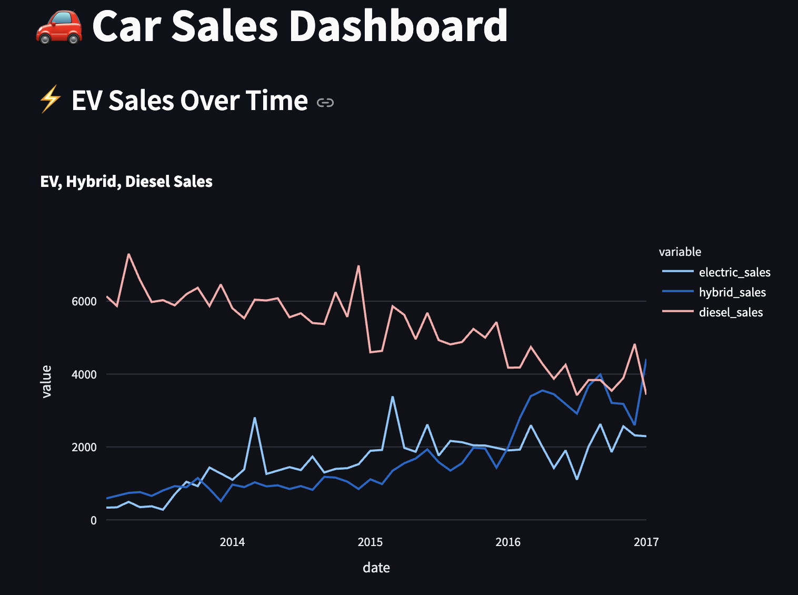

# duck-dbt-carsales
just4fun. Data from Kaggel. 

# Extract & Load
The source data is csv files downloaded from [Kaggel](https://www.kaggle.com/datasets/dmi3kno/newcarsalesnorway?resource=download). Further, the data is loaded into STG schema for further use.


# Transform 
dbt Core.


# Dashboard
Streamlit.

```bash
cd dashboard/
streamlit run streamlit_dash.py
```

# Result
Here are some example screenshots of the dashboard:

